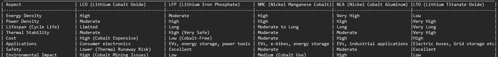

# Battery Basics

## What is a Battery?
A battery is a device that stores and converts chemical energy into electrical energy to provide a portable or stationary source of power. It consists of one or more electrochemical cells, each containing two electrodes (an anode and a cathode) and an electrolyte. When connected to a load, a chemical reaction occurs between the electrodes and the electrolyte, generating an electric current.

## Cylindrical Lithium-Ion Cells

### 18650 Cell
The 18650 cylindrical lithium-ion cell, developed in the 1990s, is widely used in laptops, e-bikes, and electric vehicles. It is named for its dimensions: **18 mm diameter** and **65 mm length**.

### 21700 Cell
The 21700 cell (also known as 2170) is slightly larger than the 18650 cell and offers **35% more energy by volume**. It is commonly used in the Tesla Model 3 and follows the IEC norm that includes the second zero to denote the cylindrical format.

### 32650 Cell
The 32650 cell is primarily available in **LiFePO₄ (Lithium Iron Phosphate)** chemistry. It has a nominal voltage of **3.2V per cell** and a typical capacity of **5,000mAh**.

---

## Four Types of Battery Cells

### 1. Cylindrical Cells
- **Description**: The most commonly used and preferred cell type.
- **Applications**: Used in medical tools, power tools, laptops, and more.
- **Popular Models**:
  - **18650**: Typically ranges from **2 Ah to 3.5 Ah**, with high-capacity models reaching up to **4 Ah or more**.
  - **21700**: Ranges from **3.0 Ah to 5.0 Ah**, with even higher capacities for EV applications.

### 2. Button/Coin Cells
- **Description**: Used in devices like cordless phones, watches, and medical implants. These cells achieve higher voltages by stacking but are prone to swelling if charged too quickly.
- **Characteristics**: Most are non-rechargeable and lack safety vents.

### 3. Prismatic Cells
- **Description**: Introduced in the 1990s, prismatic cells are compact and space-efficient.
- **Applications**: Common in mobile devices, laptops, and larger formats for EVs.
- **Capacity**: Ranges from **800mAh to 4,000mAh** for small cells and **20 Ah to 50 Ah** for larger EV applications.
- **Challenges**: Costly to manufacture, shorter cycle life, and swelling issues requiring compression.

### 4. Pouch Cells
- **Description**: Introduced in 1995, pouch cells are lightweight and flexible, achieving **90–95% packaging efficiency** by eliminating metal enclosures.
- **Applications**: Used in consumer electronics, automotive, and energy storage systems.
- **Characteristics**: Requires allowance for swelling, with improvements expected to achieve price parity with the 21700 format by 2025.

---

## Battery Configurations

### 1. Single-Cell Configuration
- **Description**: Used in devices like phones (3.6V Li-ion) and clocks (1.5V alkaline).
- **Nominal Voltages by Chemistry**:
  - Nickel: **1.2V**
  - Alkaline: **1.5V**
  - Lead Acid: **2.0V**
  - Lithium: **3.0–3.9V**
  - Li-ion: **3.6V**
  - LiFePO₄: **3.2V**

### 2. Series Configuration
- **Description**: Cells are connected in series to achieve higher voltages.
- **Example**: Four 3.6V Li-ion cells connected in series (4S) produce **14.4V**.
- **Applications**: Common in e-bikes (36–48V) and EVs (450–500V).
- **Challenges**: Requires careful cell matching to prevent failure and imbalance.

### 3. Parallel Configuration
- **Description**: Cells are connected in parallel to increase capacity while maintaining nominal voltage.
- **Characteristics**: High-resistance or open cells reduce load capacity but are less critical than in series configurations.

### 4. Series/Parallel Configuration
- **Description**: Combines series and parallel connections to achieve desired voltage and capacity.
- **Example**: A 2S2P configuration with four 3.6V, 3,400mAh cells provides **7.2V** and **48.96Wh**.
- **Applications**: Common in devices like e-bikes and EVs, requiring integrated circuits for cell monitoring and protection.

---

## Voltage and Power
- **Formula**: Voltage multiplied by current equals watts.

---

## Typical Safety Mechanisms in 18650 Cells
- **Metal Outer Jacket**: Provides structural support and protection.
- **Terminal Contact**: Acts as the electrical connection point.
- **Vent Hole**: Releases gas to prevent pressure buildup.
- **Scoring**: Facilitates venting in case of high pressure.
- **PTC (Positive Temperature Coefficient)**: Protects against overcurrent.
- **CID (Current Interrupt Device)**: Disconnects the battery in case of excessive pressure.
- **Other Components**: Include plastic inserts, bottom disk, and metallic foil for current collection.

---

## Different Chemistries in Li-Ion Batteries

### 1. Lithium Cobalt Oxide (LCO)
- **Applications**: Smartphones, laptops, cameras.
- **Advantages**: High energy density.
- **Disadvantages**: Short lifespan, moderate thermal stability, safety concerns, and high cost due to cobalt.

### 2. Lithium Iron Phosphate (LFP)
- **Applications**: EVs, energy storage, power tools.
- **Advantages**: Long cycle life, excellent safety, cobalt-free, cost-effective.
- **Disadvantages**: Lower energy density.

### 3. Lithium Nickel Manganese Cobalt Oxide (NMC)
- **Applications**: EVs, e-bikes, energy storage systems.
- **Advantages**: Balanced energy density, power density, and lifespan.
- **Disadvantages**: Higher cost and ethical concerns due to cobalt.

### 4. Lithium Nickel Cobalt Aluminum Oxide (NCA)
- **Applications**: EVs, industrial applications.
- **Advantages**: Very high energy density and long cycle life.
- **Disadvantages**: High cost and safety concerns.

### 5. Lithium Titanate (LTO)
- **Applications**: EVs, grid storage, high-demand applications.
- **Advantages**: Very long lifespan, excellent safety, fast charging.
- **Disadvantages**: Low energy density.

---
### Comparison of the four lithium-ion chemistries across key factors

## Battery Management System (BMS)
A Battery Management System ensures the safety, longevity, and performance of a battery by:
- Monitoring **State of Charge (SoC)** and **State of Health (SoH)**.
- Protecting against overcharging, deep discharge, and overheating.
- Estimating capacity degradation over time.
- Enhancing reliability in critical applications like EVs and medical devices.

---

## Internal Working of an LFP (LiFePO₄) Battery

### Electrochemical Potential
- **Anode (Graphite, C₆)**:
  - **Discharge**: LiC₆ → Li⁺ + e⁻ + C₆  
  - **Charge**: Li⁺ + e⁻ + C₆ → LiC₆
- **Cathode (LFP, LiFePO₄)**:
  - **Discharge**: FePO₄ + Li⁺ + e⁻ → LiFePO₄  
  - **Charge**: LiFePO₄ → FePO₄ + Li⁺ + e⁻

### Thermodynamics
- **Gibbs Free Energy**: Determines spontaneity and maximum electrical energy.
- **Enthalpy (ΔH)**: Indicates heat generation.
- **Entropy Changes**: Electron movement causes heat.
- **Ohmic Losses**: Resistive heat generation.

### Heat Transfer Phenomena
- **Conduction, Convection, and Radiation**: Manage heat generated during battery operation.

---

## Phase Transition in LiFePO₄
- **Low Rates**: Nanometer-thin plate-shaped domains transform slower.
- **High Rates**: Phase boundaries become diffuse, accelerating transformations.
- **Factors**: Charge/discharge rates, local current densities, and material size affect performance.

---

## Conclusion
This document provides a detailed overview of battery basics, types of cells, configurations, safety mechanisms, chemistries, and the internal working of LFP batteries. The understanding of these principles is critical for designing efficient and reliable energy storage solutions.
